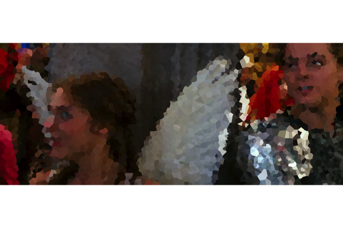
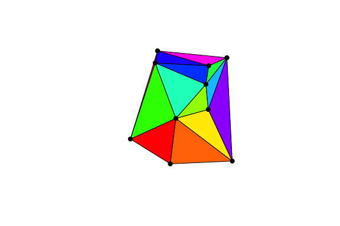
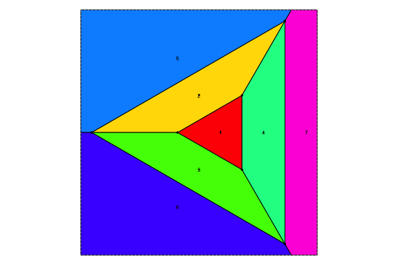

<!-- README.md is generated from README.Rmd. Please edit that file -->

# rvoronoi

<!-- badges: start -->


[](https://github.com/coolbutuseless/rvoronoi/actions/workflows/R-CMD-check.yaml)
<!-- badges: end -->

`rvoronoi` is a testing ground for some rendering ideas using fast
delaunay triangulation and voronoi tessellation.

For small sets of seed points (e.g. 20 points) this package can be 10x
faster than `RTriangle` package. For larger sets of seed points, the gap
closes up - e.g. for N = 1000, still 2x faster than `RTriangle` package.

The core of this package is Steven Fortune’s original C source code for
his sweep algorithm. This code has been updated and adapted to run
within R. [Original source code (packaged as a shell
archive)](https://netlib.sandia.gov/voronoi/sweep2)

## Installation

You can install from
[GitHub](https://github.com/coolbutuseless/rvoronoi) with:

``` r
# install.packages('remotes')
remotes::install_github('coolbutuseless/rvoronoi')
```

# In fair Voronoi, where we lay our scene

``` r
library(nara)
library(grid)

rj <- jpeg::readJPEG("man/figures/rj.jpg", native = TRUE)
dim(rj)
#> [1]  531 1278
# grid.raster(rj)


set.seed(5)
N <- 4000
x <- (runif(N, 1, ncol(rj))) |> sort() 
y <- (runif(N, 1, nrow(rj))) 

ind <- round(y) * ncol(rj) + round(x)

cols <- rj[ind]
cols <- nara::packed_cols_to_hex_cols(cols)

vor <- voronoi(as.double(x), as.double(y))
nr <- nara::nr_new(ncol(rj), nrow(rj))

for (i in seq_along(vor$polygons)) {
  nr_polygon(nr, vor$polygons[[i]]$x, vor$polygons[[i]]$y, fill = cols[i])
}
grid.raster(nr)
```



``` r
grob <- voronoiGrob(vor)
# grob$vp <- viewport(default.units = 'snpc', width = 1/1270, height = 1/1270)
grob$vp <- viewport(default.units = 'points', width = 1270, height = 670)
grid.newpage()
grid.draw(grob)
```


## Voronoi Terminology

- Initial **sites** (i.e. seed points)
- Fortune’s algorithm returns
  - **vertices**
  - **segments** (finite, semi-finite and infinite)
- This package reconstructs **polygons** (i.e. *voronoi cells*) by
  assembling the *segments* into polygons, and bounding any exterior
  *cells* by intersecting with a rectangular boundary

## Voronoi Tessellation feature comparison

| Package                   | rvoronoi | deldir | RTriangle |
|---------------------------|----------|--------|-----------|
| segments                  | Yes      |        |           |
| interior polygons         | Yes      |        |           |
| bounded exterior polygons | Yes      |        |           |
| matched sites/polygons    | Yes      |        |           |
| vertices                  | Yes      |        |           |

## Delaunay Triangulation feature comparison

| Package                          | rvoronoi | deldir | RTriangle |
|----------------------------------|----------|--------|-----------|
| site indices (defining polygons) | Yes      |        |           |
| polygon coordinates              | Yes      |        |           |

## Voronoi Tessellation

The following code calculates the voronoi tessellation on 20 random
points.

``` r
library(rvoronoi)

set.seed(4)
x <- runif(20)
y <- runif(20)

vor <- voronoi(x, y) 

plot_vor(vor) |>
  draw_polygons() |>
  draw_sites() |>
  draw_vertices(cex = 0.2)
```


## Delaunay Triangulation

``` r
library(rvoronoi)

set.seed(2024)
x <- runif(10)
y <- runif(10)

del <- delaunay(x, y)$segment

# Plot the seed points
plot(x, y, asp = 1, col = 'red', ann = F, axes = F, pch = 19)

# Plot all finite segments.  
# This will not plot any of the segments which do not converge
segments(x[del$v1], y[del$v1], x[del$v2], y[del$v2])
segments(x[del$v3], y[del$v3], x[del$v2], y[del$v2])
segments(x[del$v1], y[del$v1], x[del$v3], y[del$v3])
```



## Delaunay Benchmark

Compare Delaunay Triangulation using

- `{rvoronoi}`
- `{delone}`
  - `remotes::install_github("hypertidy/delone")`
- `{RTriangle}`
- `{deldir}`

<details>

<summary>

Delaunay Triangulation Benchmark
</summary>

``` r
#~~~~~~~~~~~~~~~~~~~~~~~~~~~~~~~~~~~~~~~~~~~~~~~~~~~~~~~~~~~~~~~~~~~~~~~~~~~~~
# Delaunay
#~~~~~~~~~~~~~~~~~~~~~~~~~~~~~~~~~~~~~~~~~~~~~~~~~~~~~~~~~~~~~~~~~~~~~~~~~~~~~
library(rvoronoi)
# library(delone)
library(RTriangle)
library(deldir)
#> deldir 2.0-4      Nickname: "Idol Comparison"
#> 
#>      The syntax of deldir() has changed since version 
#>      0.0-10.  Read the help!!!.
#> deldir 2.0-4      Nickname: "Idol Comparison"
#> 
#>      The syntax of deldir() has changed since version 
#>      0.0-10.  Read the help!!!.

set.seed(1)
N <- 1000
x <- runif(N)
y <- runif(N)

#~~~~~~~~~~~~~~~~~~~~~~~~~~~~~~~~~~~~~~~~~~~~~~~~~~~~~~~~~~~~~~~~~~~~~~~~~~~~~
# {rvoronoi}
#~~~~~~~~~~~~~~~~~~~~~~~~~~~~~~~~~~~~~~~~~~~~~~~~~~~~~~~~~~~~~~~~~~~~~~~~~~~~~
del_rvoronoi <- rvoronoi::delaunay(x, y)$segment

#~~~~~~~~~~~~~~~~~~~~~~~~~~~~~~~~~~~~~~~~~~~~~~~~~~~~~~~~~~~~~~~~~~~~~~~~~~~~~
# {delone} - normalise to 
#~~~~~~~~~~~~~~~~~~~~~~~~~~~~~~~~~~~~~~~~~~~~~~~~~~~~~~~~~~~~~~~~~~~~~~~~~~~~~
# del_delone <- delone::xy_tri(x, y)
# del_delone <- matrix(del_delone, ncol = 3, byrow = TRUE) |> as.data.frame()
# 
# stopifnot(identical(
#   rvoronoi:::normalise_del(del_rvoronoi),
#   rvoronoi:::normalise_del(del_delone)
# ))

#~~~~~~~~~~~~~~~~~~~~~~~~~~~~~~~~~~~~~~~~~~~~~~~~~~~~~~~~~~~~~~~~~~~~~~~~~~~~~
# RTriangle
#~~~~~~~~~~~~~~~~~~~~~~~~~~~~~~~~~~~~~~~~~~~~~~~~~~~~~~~~~~~~~~~~~~~~~~~~~~~~~
del_rtriangle <- RTriangle::triangulate(RTriangle::pslg(cbind(x, y)))$T
del_rtriangle <- as.data.frame(del_rtriangle)

stopifnot(identical(
  rvoronoi:::normalise_del(del_rvoronoi),
  rvoronoi:::normalise_del(del_rtriangle)
))


#~~~~~~~~~~~~~~~~~~~~~~~~~~~~~~~~~~~~~~~~~~~~~~~~~~~~~~~~~~~~~~~~~~~~~~~~~~~~~
# deldir
#~~~~~~~~~~~~~~~~~~~~~~~~~~~~~~~~~~~~~~~~~~~~~~~~~~~~~~~~~~~~~~~~~~~~~~~~~~~~~
del_deldir <- deldir::deldir(x, y)
del_deldir <- deldir::triMat(del_deldir)
del_deldir <- as.data.frame(del_deldir)

stopifnot(identical(
  rvoronoi:::normalise_del(del_rvoronoi),
  rvoronoi:::normalise_del(del_deldir)
))
```

</details>

``` r
#~~~~~~~~~~~~~~~~~~~~~~~~~~~~~~~~~~~~~~~~~~~~~~~~~~~~~~~~~~~~~~~~~~~~~~~~~~~~~
# Benchmark
#~~~~~~~~~~~~~~~~~~~~~~~~~~~~~~~~~~~~~~~~~~~~~~~~~~~~~~~~~~~~~~~~~~~~~~~~~~~~~
bench::mark(
  # delone    = xy_tri  (x, y),
  rvoronoi  = delaunay(x, y),
  rtriangle = triangulate(pslg(cbind(x, y))),
  deldir    = deldir(x, y),
  check = FALSE
)[,1:5]  |> knitr::kable()
```

| expression |     min |  median |    itr/sec | mem_alloc |
|:-----------|--------:|--------:|-----------:|----------:|
| rvoronoi   | 392.5µs | 412.2µs | 2410.61717 |  139.56KB |
| rtriangle  | 725.6µs | 764.6µs | 1283.33544 |  292.63KB |
| deldir     |  16.7ms |  17.1ms |   58.54301 |    5.67MB |

# Voronoi Tessellation Benchmark

Compare:

- `{rvoronoi}`
- `{deldir}`
- `{RTriangle}`

<details>

<summary>

Voronoi Tessellation Benchmark
</summary>

``` r
#~~~~~~~~~~~~~~~~~~~~~~~~~~~~~~~~~~~~~~~~~~~~~~~~~~~~~~~~~~~~~~~~~~~~~~~~~~~~~
# Voronoi
#~~~~~~~~~~~~~~~~~~~~~~~~~~~~~~~~~~~~~~~~~~~~~~~~~~~~~~~~~~~~~~~~~~~~~~~~~~~~~
library(rvoronoi)
library(deldir)
library(RTriangle)

set.seed(1)
N <- 1000
x <- runif(N)
y <- runif(N)

#~~~~~~~~~~~~~~~~~~~~~~~~~~~~~~~~~~~~~~~~~~~~~~~~~~~~~~~~~~~~~~~~~~~~~~~~~~~~~
# rvoronoi
#~~~~~~~~~~~~~~~~~~~~~~~~~~~~~~~~~~~~~~~~~~~~~~~~~~~~~~~~~~~~~~~~~~~~~~~~~~~~~
vor_rvoronoi <- rvoronoi::voronoi(x, y)

# plot(x, y, asp = 1, ann = F, axes = F, pch = '.')
# for (p in vor_rvoronoi$polygons) {
#   polygon(p)
# }


#~~~~~~~~~~~~~~~~~~~~~~~~~~~~~~~~~~~~~~~~~~~~~~~~~~~~~~~~~~~~~~~~~~~~~~~~~~~~~
# deldir
#~~~~~~~~~~~~~~~~~~~~~~~~~~~~~~~~~~~~~~~~~~~~~~~~~~~~~~~~~~~~~~~~~~~~~~~~~~~~~
vor_deldir   <- deldir::cvt(deldir::deldir(x, y), stopcrit = 'maxit', maxit = 1)

# plot(x, y, asp = 1, ann = F, axes = F, pch = '.')
# for (p in vor_deldir$tiles) {
#   polygon(p)
# }

#~~~~~~~~~~~~~~~~~~~~~~~~~~~~~~~~~~~~~~~~~~~~~~~~~~~~~~~~~~~~~~~~~~~~~~~~~~~~~
# RTriangle
#~~~~~~~~~~~~~~~~~~~~~~~~~~~~~~~~~~~~~~~~~~~~~~~~~~~~~~~~~~~~~~~~~~~~~~~~~~~~~
tri <- triangulate(pslg(P = cbind(x, y)))
ve <- tri$VE |> as.data.frame()
ve <- subset(ve, V1 > 0 & V2 > 0)

# plot(x, y, asp = 1, ann = F, axes = F, pch = '.')
# p1 <- tri$VP[ve$V1, ] |> as.data.frame()
# p2 <- tri$VP[ve$V2, ] |> as.data.frame()
# segments(p1$V1, p1$V2, p2$V1, p2$V2)
```

</details>

``` r
bench::mark(
  voronoi(x, y),
  cvt(deldir(x, y), stopcrit = 'maxit', maxit = 1),
  triangulate(pslg(P = cbind(x, y))),
  check = FALSE
)[,1:5] |> knitr::kable()
#> Warning: Some expressions had a GC in every iteration; so filtering is
#> disabled.
```

| expression | min | median | itr/sec | mem_alloc |
|:---|---:|---:|---:|---:|
| voronoi(x, y) | 3.5ms | 3.6ms | 274.205035 | 235KB |
| cvt(deldir(x, y), stopcrit = “maxit”, maxit = 1) | 161.2ms | 162.3ms | 6.126727 | 52.1MB |
| triangulate(pslg(P = cbind(x, y))) | 726.7µs | 765.1µs | 1217.402095 | 292.6KB |

# Pathological Test Cases

## Pathological 1

- 100 points in a circle

``` r
theta <- seq(0, 2*pi, length.out = 101)[-1]
x <- cos(theta)
y <- sin(theta)

vor <- voronoi(x, y)

plot_vor(vor) |>
  draw_polygons() |>
  draw_sites(text = FALSE) |>
  draw_vertices()
```


## Pathological 2

- 100 points in a circle
- 1 point at the centre

``` r
theta <- seq(0, 2*pi, length.out = 101)[-1]
x <- c(0, cos(theta))
y <- c(0, sin(theta))

vor <- voronoi(x, y)

plot_vor(vor) |>
  draw_polygons() |>
  draw_sites() |>
  draw_vertices(cex = 0.3)
```


## Pathological 2a

- 2 concentric circles (100 points each)
- 1 point at the centre

``` r
theta <- seq(0, 2*pi, length.out = 101)[-1]
x <- c(0, cos(theta), 2 * cos(theta))
y <- c(0, sin(theta), 2 * sin(theta))

vor <- voronoi(x, y)


plot_vor(vor) |>
  draw_polygons() |>
  draw_sites() |>
  draw_vertices(cex = 0.3)
```


## Pathological 3

- 100 points in a line

``` r
x <- seq(0, 2*pi, length.out = 100)
y <- 0.5 * x  

vor <- voronoi(x, y)

plot_vor(vor) |>
  draw_polygons() |>
  draw_sites() |>
  draw_vertices()
```


## Pathological 4

- 2 concentric equalateral triangles
- 1 point at the centre

``` r
theta <- seq(0, 2*pi, length.out = 4)[-1]
x <- c(0, cos(theta), 2 * cos(theta))
y <- c(0, sin(theta), 2 * sin(theta))

vor <- voronoi(x, y)


plot_vor(vor) |>
  draw_polygons() |>
  draw_sites() |>
  draw_vertices()
```



# Algorithms

- Fortune’s Sweep Algorithm for Delaunay
  - Adapted original source code to call from R
- Polygon reconstruction
  - Use voronoi vertices and edge connectivity to reconstruct polygonal
    voronoi tiles
  - Using “An optimal algorithm for extracting the regions of a plane
    graph” by Jiang & Bunke, Pattern Recognition Letters 14 (1993)
    pp553-558.
  - Adapted algorithm from binary search to instead use pre-indexed
    search bounds.
- Point in polygon (to match seed points to voronoi polygons)
  - Search for bounding box collision to filter polygon candidates for
    exhaustive testing
  - Optimised point-in-polygon search with early termination possible
    (as voronoi polygons are **always** convex) Test edges using the
    “leftOf()” operator, and exit as soon as any vertices are right of a
    polygon edge.
  - No benefit in building an acceleration structure for
    point-in-bounding-box when there of the order of ~100-1000 bounding
    boxes. A linear search (with flagging of polygons already claimed)
    is fast enough. If use case if voronoi of \>\> 1000 points, then
    time taken to build acceleration structure (e.g. hierachical
    bounding boxes) would become worth it.

## Related

- [mdsumner’s helpful
  gist](https://gist.github.com/mdsumner/8db5ac01e47fa86f10e7ebc372e0ebda?permalink_comment_id=5171205)
- [`RTriangle::triangulate()`]()
- [`terra::voronoi()`](https://rspatial.github.io/terra/reference/voronoi.html)
- [`geos::geos_voronoi_polygons()`]()
