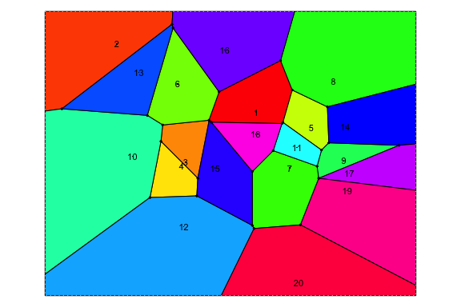
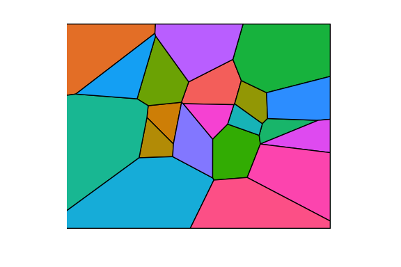
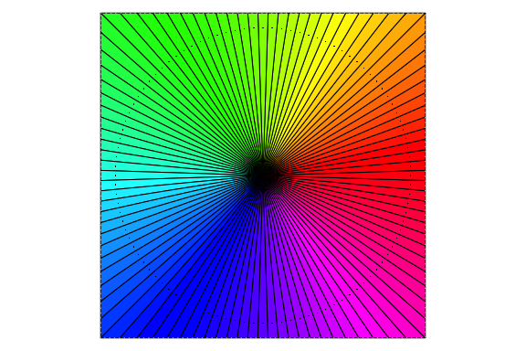
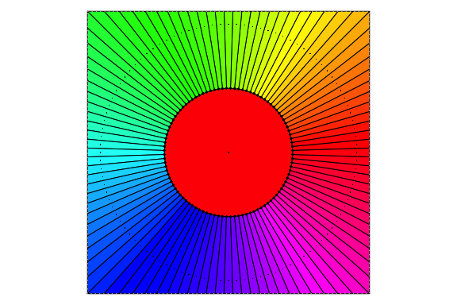
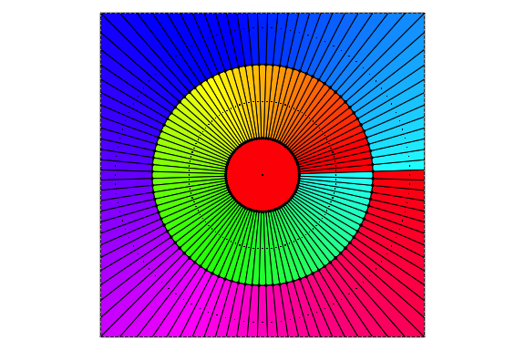
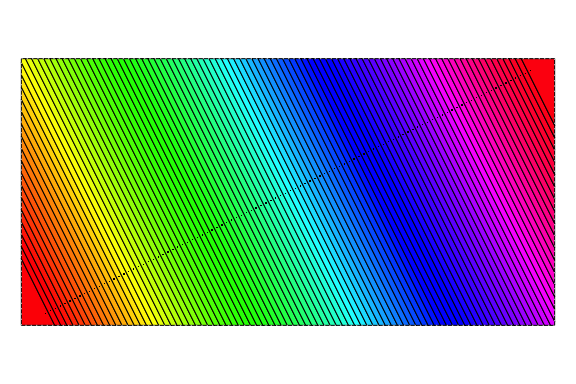

<!-- README.md is generated from README.Rmd. Please edit that file -->

# rvoronoi

<!-- badges: start -->


[](https://github.com/coolbutuseless/rvoronoi/actions/workflows/R-CMD-check.yaml)
<!-- badges: end -->

`rvoronoi` provides fast Delaunay triangulation and Voronoi tessellation
using [Fortune’s Sweep Line
Algorithm](https://en.wikipedia.org/wiki/Fortune%27s_algorithm).

A key benefit of this package (besides *speed!*) is that the Voronoi
tesselation can return a full set of enclosed polygons matched to the
input sites. This makes it convenient for plotting.

The core of this package is Steven Fortune’s original C source code for
his sweep algorithm. This code has been updated and adapted to run
within R. [Original source code (packaged as a shell
archive)](https://netlib.sandia.gov/voronoi/sweep2)

For small sets of site (e.g. 20 points) this package can be 10x faster
than `RTriangle` package. For larger sets of sites, the gap closes up -
e.g. for N = 1000, still 2x faster than `RTriangle` package.

## Installation

You can install from
[GitHub](https://github.com/coolbutuseless/rvoronoi) with:

``` r
# install.packages('remotes')
remotes::install_github('coolbutuseless/rvoronoi')
```

# In fair Voronoi, where we lay our scene

A Voronoi tessellation of a scene from 1996 movie [Romeo +
Juliet](https://www.imdb.com/title/tt0117509/?ref_=fn_al_tt_1)

``` r
library(nara)
library(grid)

#~~~~~~~~~~~~~~~~~~~~~~~~~~~~~~~~~~~~~~~~~~~~~~~~~~~~~~~~~~~~~~~~~~~~~~~~~~~~
# Load image
#~~~~~~~~~~~~~~~~~~~~~~~~~~~~~~~~~~~~~~~~~~~~~~~~~~~~~~~~~~~~~~~~~~~~~~~~~~~~
rj <- jpeg::readJPEG("man/figures/rj.jpg", native = TRUE)

#~~~~~~~~~~~~~~~~~~~~~~~~~~~~~~~~~~~~~~~~~~~~~~~~~~~~~~~~~~~~~~~~~~~~~~~~~~~~
# Sample lots of random points in the image
#~~~~~~~~~~~~~~~~~~~~~~~~~~~~~~~~~~~~~~~~~~~~~~~~~~~~~~~~~~~~~~~~~~~~~~~~~~~~
set.seed(5)
N <- 4000
x <- (runif(N, 1, ncol(rj))) 
y <- (runif(N, 1, nrow(rj))) 

#~~~~~~~~~~~~~~~~~~~~~~~~~~~~~~~~~~~~~~~~~~~~~~~~~~~~~~~~~~~~~~~~~~~~~~~~~~~~
# Extract the colour at each pointt
#~~~~~~~~~~~~~~~~~~~~~~~~~~~~~~~~~~~~~~~~~~~~~~~~~~~~~~~~~~~~~~~~~~~~~~~~~~~~
ind  <- round(y) * ncol(rj) + round(x)
cols <- rj[ind]
cols <- nara::packed_cols_to_hex_cols(cols)

#~~~~~~~~~~~~~~~~~~~~~~~~~~~~~~~~~~~~~~~~~~~~~~~~~~~~~~~~~~~~~~~~~~~~~~~~~~~~
# Calculate the Voronoi
#~~~~~~~~~~~~~~~~~~~~~~~~~~~~~~~~~~~~~~~~~~~~~~~~~~~~~~~~~~~~~~~~~~~~~~~~~~~~
vor <- voronoi(as.double(x), as.double(y))

#~~~~~~~~~~~~~~~~~~~~~~~~~~~~~~~~~~~~~~~~~~~~~~~~~~~~~~~~~~~~~~~~~~~~~~~~~~~~
# Plot all Voronoi polygons in their appropriate colour
#~~~~~~~~~~~~~~~~~~~~~~~~~~~~~~~~~~~~~~~~~~~~~~~~~~~~~~~~~~~~~~~~~~~~~~~~~~~~
nr <- nara::nr_new(ncol(rj), nrow(rj))
for (i in seq_len(vor$polygons$npolygons)) {
  nr_polygon(nr, vor$polygons$individual[[i]]$x, vor$polygons$individual[[i]]$y, fill = cols[i])
}
grid.raster(nr)
```


## Voronoi Terminology

- Initial **sites** (i.e. seed points)
- Fortune’s algorithm returns
  - **vertices**
  - **segments** (finite, semi-finite and infinite)
- This package reconstructs **polygons** (i.e. *Voronoi cells*) by
  assembling the *segments* into polygons, and bounding any exterior
  *cells* by intersecting with a rectangular boundary

## Voronoi Tessellation feature comparison

| Package                   | rvoronoi | deldir | RTriangle |
|---------------------------|----------|--------|-----------|
| vertices                  | Yes      | Yes    | Yes       |
| segments                  | Yes      | Yes    | Yes       |
| interior polygons         | Yes      | Yes    |           |
| bounded exterior polygons | Yes      | Yes    |           |
| matched sites/polygons    | Yes      | ???    |           |

## Delaunay Triangulation feature comparison

| Package                          | rvoronoi | deldir | RTriangle |
|----------------------------------|----------|--------|-----------|
| site indices (defining polygons) | Yes      | Yes    | Yes       |
| polygon coordinates              | Yes      |        |           |

## Voronoi Tessellation

The following code calculates the Voronoi tessellation on 20 random
points.

``` r
library(rvoronoi)

set.seed(4)
x <- runif(20)
y <- runif(20)

vor <- voronoi(x, y) 

plot(vor, polys = FALSE, sites = TRUE, labels = TRUE, label_cex = 0.7)
```


``` r
plot(vor, labels = TRUE, label_cex = 0.7)
```



``` r
library(ggplot2)

ggplot() + 
  geom_polygon(data = vor$polygons$coords, 
               aes(x, y, group = idx, fill = as.factor(idx)), 
               col = 'black') +
  theme_void() + 
  coord_equal(xlim = c(-0.2, 1.2), ylim = c(-0.2, 1.2)) +
  theme(
    legend.position = 'none'
  )
```



## Delaunay Triangulation

``` r
library(rvoronoi)

set.seed(2024)
x <- runif(10)
y <- runif(10)

del <- delaunay(x, y)

plot(del)
```


## Delaunay Benchmark

Compare Delaunay Triangulation using

- `{rvoronoi}`
- `{delone}`
  - `remotes::install_github("hypertidy/delone")`
- `{RTriangle}`
- `{deldir}`

<details>
<summary>
Delaunay Triangulation Benchmark
</summary>

``` r
#~~~~~~~~~~~~~~~~~~~~~~~~~~~~~~~~~~~~~~~~~~~~~~~~~~~~~~~~~~~~~~~~~~~~~~~~~~~~~
# Delaunay
#~~~~~~~~~~~~~~~~~~~~~~~~~~~~~~~~~~~~~~~~~~~~~~~~~~~~~~~~~~~~~~~~~~~~~~~~~~~~~
library(rvoronoi)
# library(delone)
library(RTriangle)
library(deldir)
#> deldir 2.0-4      Nickname: "Idol Comparison"
#> 
#>      The syntax of deldir() has changed since version 
#>      0.0-10.  Read the help!!!.
```

``` r
#> deldir 2.0-4      Nickname: "Idol Comparison"
#> 
#>      The syntax of deldir() has changed since version 
#>      0.0-10.  Read the help!!!.

set.seed(1)
N <- 1000
x <- runif(N)
y <- runif(N)

#~~~~~~~~~~~~~~~~~~~~~~~~~~~~~~~~~~~~~~~~~~~~~~~~~~~~~~~~~~~~~~~~~~~~~~~~~~~~~
# {rvoronoi}
#~~~~~~~~~~~~~~~~~~~~~~~~~~~~~~~~~~~~~~~~~~~~~~~~~~~~~~~~~~~~~~~~~~~~~~~~~~~~~
del_rvoronoi <- rvoronoi::delaunay(x, y)$tris

#~~~~~~~~~~~~~~~~~~~~~~~~~~~~~~~~~~~~~~~~~~~~~~~~~~~~~~~~~~~~~~~~~~~~~~~~~~~~~
# {delone} - normalise to 
#~~~~~~~~~~~~~~~~~~~~~~~~~~~~~~~~~~~~~~~~~~~~~~~~~~~~~~~~~~~~~~~~~~~~~~~~~~~~~
# del_delone <- delone::xy_tri(x, y)
# del_delone <- matrix(del_delone, ncol = 3, byrow = TRUE) |> as.data.frame()
# 
# stopifnot(identical(
#   rvoronoi:::normalise_del(del_rvoronoi),
#   rvoronoi:::normalise_del(del_delone)
# ))

#~~~~~~~~~~~~~~~~~~~~~~~~~~~~~~~~~~~~~~~~~~~~~~~~~~~~~~~~~~~~~~~~~~~~~~~~~~~~~
# RTriangle
#~~~~~~~~~~~~~~~~~~~~~~~~~~~~~~~~~~~~~~~~~~~~~~~~~~~~~~~~~~~~~~~~~~~~~~~~~~~~~
del_rtriangle <- RTriangle::triangulate(RTriangle::pslg(cbind(x, y)))$T
del_rtriangle <- as.data.frame(del_rtriangle)

stopifnot(identical(
  rvoronoi:::normalise_del(del_rvoronoi),
  rvoronoi:::normalise_del(del_rtriangle)
))


#~~~~~~~~~~~~~~~~~~~~~~~~~~~~~~~~~~~~~~~~~~~~~~~~~~~~~~~~~~~~~~~~~~~~~~~~~~~~~
# deldir
#~~~~~~~~~~~~~~~~~~~~~~~~~~~~~~~~~~~~~~~~~~~~~~~~~~~~~~~~~~~~~~~~~~~~~~~~~~~~~
del_deldir <- deldir::deldir(x, y)
del_deldir <- deldir::triMat(del_deldir)
del_deldir <- as.data.frame(del_deldir)

stopifnot(identical(
  rvoronoi:::normalise_del(del_rvoronoi),
  rvoronoi:::normalise_del(del_deldir)
))
```

</details>

``` r
bench::mark(
  # delone    = xy_tri  (x, y),
  rvoronoi  = delaunay(x, y, calc_polygons = TRUE),
  rvoronoi  = delaunay(x, y, calc_polygons = FALSE),
  rvoronoi  = delaunay(x, y, calc_polygons = FALSE, calc_areas = TRUE),
  rvoronoi  = delaunay(x, y, calc_polygons = FALSE, calc_segments = TRUE),
  rtriangle = triangulate(pslg(cbind(x, y))),
  deldir    = deldir(x, y),
  check = FALSE
)[,1:5]  |> knitr::kable()
```

| expression |      min |   median |    itr/sec | mem_alloc |
|:-----------|---------:|---------:|-----------:|----------:|
| rvoronoi   | 736.81µs | 744.98µs | 1328.60692 |  162.78KB |
| rvoronoi   | 726.17µs | 735.38µs | 1315.61039 |   23.58KB |
| rvoronoi   |  729.6µs | 737.62µs | 1254.16483 |   39.07KB |
| rvoronoi   |   1.18ms |   1.22ms |  715.48243 |  163.41KB |
| rtriangle  |   1.46ms |   1.54ms |  529.78681 |  292.63KB |
| deldir     |  24.41ms |  25.16ms |   38.68707 |    5.67MB |

# Voronoi Tessellation Benchmark

Compare:

- `{rvoronoi}`
- `{deldir}`
- `{RTriangle}`

<details>
<summary>
Voronoi Tessellation Benchmark
</summary>

``` r
#~~~~~~~~~~~~~~~~~~~~~~~~~~~~~~~~~~~~~~~~~~~~~~~~~~~~~~~~~~~~~~~~~~~~~~~~~~~~~
# Voronoi
#~~~~~~~~~~~~~~~~~~~~~~~~~~~~~~~~~~~~~~~~~~~~~~~~~~~~~~~~~~~~~~~~~~~~~~~~~~~~~
library(rvoronoi)
library(deldir)
library(RTriangle)

set.seed(1)
N <- 1000
x <- runif(N)
y <- runif(N)

#~~~~~~~~~~~~~~~~~~~~~~~~~~~~~~~~~~~~~~~~~~~~~~~~~~~~~~~~~~~~~~~~~~~~~~~~~~~~~
# rvoronoi
#~~~~~~~~~~~~~~~~~~~~~~~~~~~~~~~~~~~~~~~~~~~~~~~~~~~~~~~~~~~~~~~~~~~~~~~~~~~~~
vor_rvoronoi <- rvoronoi::voronoi(x, y)

if (FALSE) {
  plot(x, y, asp = 1, ann = F, axes = F, pch = '.')
  for (p in vor_rvoronoi$polygons) {
    polygon(p)
  }
}


#~~~~~~~~~~~~~~~~~~~~~~~~~~~~~~~~~~~~~~~~~~~~~~~~~~~~~~~~~~~~~~~~~~~~~~~~~~~~~
# deldir
#~~~~~~~~~~~~~~~~~~~~~~~~~~~~~~~~~~~~~~~~~~~~~~~~~~~~~~~~~~~~~~~~~~~~~~~~~~~~~
vor_deldir   <- deldir::cvt(deldir::deldir(x, y), stopcrit = 'maxit', maxit = 1, verb = TRUE)
```

``` r

if (FALSE) {
  plot(x, y, asp = 1, ann = F, axes = F, pch = '.')
  for (p in vor_deldir$tiles) {
    polygon(p)
  }
}

if (FALSE) {
  plot(vor_deldir$tiles)
}
  
if (FALSE) {
  set.seed(42)
  x <- runif(20)
  y <- runif(20)
  dxy <- deldir(x,y,rw=c(0,1,0,1))
  cxy1 <- cvt(dxy,verb=TRUE, stopcrit = 'maxit', maxit = 1)
  plot(cxy1$tiles)
  with(cxy1$centroids,points(x,y,pch=20,col="red"))
  cxy2 <- cvt(dxy,stopcrit="m",verb=TRUE)
  plot(cxy2$tiles)
  with(cxy2$centroids,points(x,y,pch=20,col="red"))
}

#~~~~~~~~~~~~~~~~~~~~~~~~~~~~~~~~~~~~~~~~~~~~~~~~~~~~~~~~~~~~~~~~~~~~~~~~~~~~~
# RTriangle
#~~~~~~~~~~~~~~~~~~~~~~~~~~~~~~~~~~~~~~~~~~~~~~~~~~~~~~~~~~~~~~~~~~~~~~~~~~~~~
tri <- triangulate(pslg(P = cbind(x, y)))
ve <- tri$VE |> as.data.frame()
ve <- subset(ve, V1 > 0 & V2 > 0)

if (FALSE) {
  plot(x, y, asp = 1, ann = F, axes = F, pch = '.')
  p1 <- tri$VP[ve$V1, ] |> as.data.frame()
  p2 <- tri$VP[ve$V2, ] |> as.data.frame()
  segments(p1$V1, p1$V2, p2$V1, p2$V2)
}
```

</details>

### Voronoi - vertices and segments only

``` r
bench::mark(
  `rvoronoi (match RTriangle)`  = voronoi(x, y, calc_polygons = FALSE, bound_segments = FALSE),
  RTriangle = RTriangle::triangulate(pslg(P = cbind(x, y))),
  check = FALSE
)[,1:5] |> knitr::kable()
```

| expression                 |     min |   median |   itr/sec | mem_alloc |
|:---------------------------|--------:|---------:|----------:|----------:|
| rvoronoi (match RTriangle) | 759.1µs | 773.86µs | 1164.2230 |     137KB |
| RTriangle                  |  1.46ms |   1.52ms |  618.5091 |     293KB |

### Voronoi - polygons

``` r
bench::mark(
  `rvoronoi (matched polygons)` = voronoi(x, y, calc_polygons = TRUE, match_sites = TRUE),
  `rvoronoi (unmatched polygons)` = voronoi(x, y, calc_polygons = TRUE, match_sites = FALSE),
  deldir    = deldir::cvt(deldir(x, y), stopcrit = 'maxit', maxit = 1),
  check = FALSE
)[,1:5] |> knitr::kable()
#> Warning: Some expressions had a GC in every iteration; so filtering is
#> disabled.
```

| expression                    |      min |   median |    itr/sec | mem_alloc |
|:------------------------------|---------:|---------:|-----------:|----------:|
| rvoronoi (matched polygons)   |   6.17ms |   6.45ms | 147.934029 |   438.2KB |
| rvoronoi (unmatched polygons) |   4.79ms |   4.96ms | 165.933238 |   438.2KB |
| deldir                        | 547.91ms | 547.91ms |   1.825103 |    52.1MB |

# Pathological Test Cases

## Pathological 1

- 100 points in a circle

``` r
theta <- seq(0, 2*pi, length.out = 101)[-1]
x <- cos(theta)
y <- sin(theta)

vor <- voronoi(x, y)
plot(vor)
```



## Pathological 2

- 100 points in a circle
- 1 point at the centre

``` r
theta <- seq(0, 2*pi, length.out = 101)[-1]
x <- c(0, cos(theta))
y <- c(0, sin(theta))

vor <- voronoi(x, y)
plot(vor)
```



## Pathological 2a

- 2 concentric circles (100 points each)
- 1 point at the centre

``` r
theta <- seq(0, 2*pi, length.out = 101)[-1]
x <- c(0, cos(theta), 2 * cos(theta))
y <- c(0, sin(theta), 2 * sin(theta))

vor <- voronoi(x, y)
plot(vor)
```



## Pathological 3

- 100 points in a line

``` r
x <- seq(0, 2*pi, length.out = 100)
y <- 0.5 * x  

vor <- voronoi(x, y)
plot(vor)
```



## Pathological 4

- 2 concentric equilateral triangles
- 1 point at the centre

``` r
theta <- seq(0, 2*pi, length.out = 4)[-1]
x <- c(0, cos(theta), 2 * cos(theta))
y <- c(0, sin(theta), 2 * sin(theta))

vor <- voronoi(x, y)
plot(vor, labels = TRUE)
```


# Algorithms

- Fortune’s Sweep Algorithm for Delaunay
  - Adapted original source code to call from R
- Polygon reconstruction
  - Use Voronoi vertices and segment connectivity to reconstruct
    polygonal Voronoi cells
  - Using “An optimal algorithm for extracting the regions of a plane
    graph” by Jiang & Bunke, Pattern Recognition Letters 14 (1993)
    pp553-558.
  - Adapted algorithm from binary search to instead use pre-indexed
    search bounds.
- Point in polygon (to match sites to Voronoi polygons)
  - Search for bounding box collision to filter polygon candidates for
    exhaustive testing
  - Optimised point-in-polygon search with early termination possible
    (as Voronoi polygons are **always** convex) Test edges using the
    “leftOf()” operator, and exit as soon as any vertices are right of a
    polygon edge.
  - No benefit in building an acceleration structure for
    point-in-bounding-box when there of the order of ~100-1000 bounding
    boxes. A linear search (with flagging of polygons already claimed)
    is fast enough. If use case if Voronoi of \>\> 1000 points, then
    time taken to build acceleration structure (e.g. hierachical
    bounding boxes) would become worth it.

## Related

- [mdsumner’s helpful
  gist](https://gist.github.com/mdsumner/8db5ac01e47fa86f10e7ebc372e0ebda?permalink_comment_id=5171205)
- [`RTriangle::triangulate()`]()
- [`terra::voronoi()`](https://rspatial.github.io/terra/reference/voronoi.html)
- [`geos::geos_voronoi_polygons()`]()
