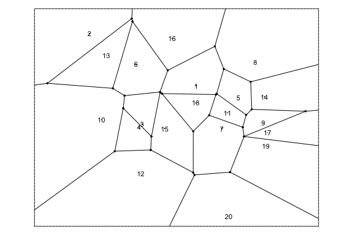

<!-- README.md is generated from README.Rmd. Please edit that file -->

# rvoronoi

<!-- badges: start -->


[](https://github.com/coolbutuseless/voronoi-dev/actions/workflows/R-CMD-check.yaml)
<!-- badges: end -->

`rvoronoi` is a testing ground for some rendering ideas using fast
delaunay triangulation and voronoi tesselation.

The core of this package is Steven Fortune’s original C source code for
his sweep algorithm. This code has been updated and adapted to run
within R. [Original Source has a shell
archive](https://netlib.sandia.gov/voronoi/sweep2)

## Installation

You can install from
[GitHub](https://github.com/coolbutuseless/rvoronoi) with:

``` r
# install.packages('remotes')
remotes::install_github('coolbutuseless/rvoronoi')
```

## Voronoi Tesselation

The following code calculates the voronoi tesselation on 20 random
points.

Only finite length segments are plotted. Segments which head to infinity
are not plotted here.

``` r
library(rvoronoi)

set.seed(2)
x <- runif(20)
y <- runif(20)

vor <- voronoi(x, y) 

# Plot the seed points
plot(x, y, asp = 1, col = 'red')

# Plot all finite segments.  
# This will not plot any of the segments which do not converge
segments(
  vor$vertex$x[vor$segment$v1],
  vor$vertex$y[vor$segment$v1],
  vor$vertex$x[vor$segment$v2],
  vor$vertex$y[vor$segment$v2],
)
```



## Delaunay Triangulation

``` r
library(rvoronoi)

set.seed(2024)
x <- runif(10)
y <- runif(10)

del <- delaunay(x, y) 

# Plot the seed points
plot(x, y, asp = 1, col = 'red')

# Plot all finite segments.  
# This will not plot any of the segments which do not converge
segments(x[del$v1], y[del$v1], x[del$v2], y[del$v2])
segments(x[del$v3], y[del$v3], x[del$v2], y[del$v2])
segments(x[del$v1], y[del$v1], x[del$v3], y[del$v3])
```


## Delaunay Benchmark

Simple benchmark comparing this package with `{RTriangle}`

Benchmarking code for other packages is welcomed!

``` r
library(RTriangle)

set.seed(2024)
N <- 100
x <- runif(N)
y <- runif(N)

del_rtriangle <- RTriangle::triangulate(RTriangle::pslg(P = cbind(x, y)))$T
del_new       <- delaunay(x, y)

identical(
  rvoronoi:::normalise_del(del_new),
  rvoronoi:::normalise_del(del_rtriangle)
)
#> [1] TRUE
```

| expression    |    min | median |  itr/sec | mem_alloc |
|:--------------|-------:|-------:|---------:|----------:|
| del_rtriangle | 88.3µs | 94.1µs | 10314.01 |   29.45KB |
| del_new       | 19.2µs | 20.1µs | 48309.73 |    2.48KB |

## Related

- [mdsumner’s helpful
  gist](https://gist.github.com/mdsumner/8db5ac01e47fa86f10e7ebc372e0ebda?permalink_comment_id=5171205)
- [`RTriangle::triangulate()`]()
- [`terra::voronoi()`](https://rspatial.github.io/terra/reference/voronoi.html)
- [`geos::geos_voronoi_polygons()`]()
